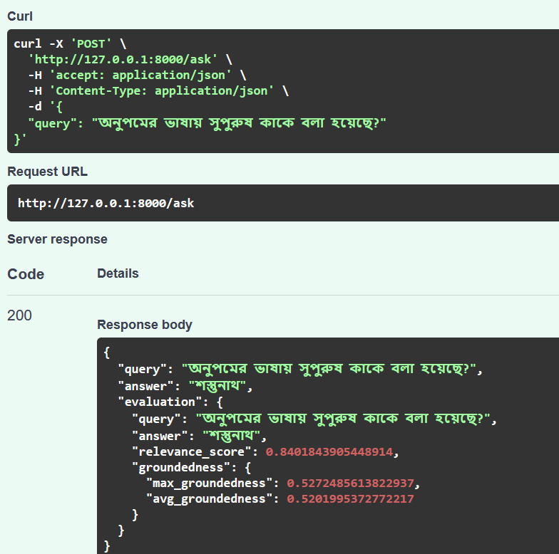

# Multilingual-RAG-System

A **Multilingual Retrieval-Augmented Generation (RAG)** system powered by Bangla HSC 1st Paper. Supports English and Bengali queries using a vector database and a generative model for accurate, grounded answers.

---

##  Objective

Build a multilingual RAG system that retrieves and generates answers from a **Bangla textbook** using semantic similarity and modern language models.

---

##  Features

-  Bengali and English query support
-  PDF-based knowledge extraction
-  FAISS-based semantic vector search
-  OpenAI GPT-3.5 support
-  Short & long-term memory integration
-  FastAPI Backend
-  Basic RAG evaluation (relevance + groundedness)
-  Swagger based documentation

---

##  Project Structure

├── app/
│ ├── main.py # FastAPI app
│ ├── agent.py # Retrieval + generation
│ ├── memory.py # Short-term memory
│ ├── evaluation.py # RAG evaluation logic
│ ├── models.py # Pydantic request/response models
│ ├── config.py # Model, vector index, and chunks
├── vector_store/
│ ├── chunks.pkl
| ├── faiss.index
├── build_vector_store.py # Extract + chunk + vectorize PDF
├── HSC26-Bangla1st-Paper.pdf # Source PDF
├── docker-compose.yml
├── Dockerfile
├── requirements.txt
├── .env
└── README.md


---

##  Setup

###  Installation

```bash
git clone https://github.com/noshinfaria/Multilingual-RAG-System.git
cd multilingual-rag-system
```

### Run Locally
Step 1: Build Vectors (optional as already created)

```bash
docker-compose up vector-builder
```

Step 2: Run the API
```bash
docker-compose up app
```

Go to browser and paste for API documentation
```bash
http://localhost:8000/docs
```

### Sample Queries




### RAG Strategy
- Text Extraction: pdfplumber + fallback OCR via pytesseract for malformed text
- Chunking: Sentence-based chunking with overlap to preserve semantic context
- Embeddings: all-MiniLM-L6-v2 via SentenceTransformer
- Similarity Search: FAISS (cosine similarity)
- Memory:
    - Short-Term: Last user query + answer history
    - Long-Term: Retrieved document chunks from vector DB


### Tools Used
-  SentenceTransformers (all-MiniLM-L6-v2)
-  FAISS for semantic vector search
-  OpenAI for LLM generation
-  FastAPI + Pydantic
-  pdfplumber, tesseract for text extraction
-  Docker & Docker Compose


## Technical Questions (Answered)
### 1. What method or library did you use to extract the text, and why? Did you face any formatting challenges?
```bash
I used pdfplumber for structured text extraction. When Bengali text rendered incorrectly, due to font issues and encoding, fallback OCR via pytesseract was applied per-page. Challenges included fragmented Unicode characters, which were normalized post-extraction.
```

### 2. What chunking strategy did you choose? Why?
```bash
Sentence-based chunking with overlap, ensuring semantic continuity across context windows. This works well for language models and retrieval systems since each chunk often contains a meaningful unit of thought.
```

### 3. What embedding model did you use? Why?
```bash
all-MiniLM-L6-v2 (from SentenceTransformers). It's lightweight and performs well for multilingual semantic tasks, balancing speed and contextual accuracy.
```

### 4. How are you comparing the query with stored chunks?
```bash
Using cosine similarity between the query embedding and document chunk embeddings via FAISS. Cosine similarity is standard for semantic relevance.
```

### 5. How do you ensure meaningful query-chunk comparison?
```bash
- Cleaned, normalized chunks
- Sentence-level chunking
- Embeddings trained for semantic similarity
If the query is vague, the model still attempts best-match via dense vector space — but might retrieve irrelevant results. Better chunking or query rewriting could help.
```

### 6. Do the results seem relevant? If not, how might you improve them?
```bash
Generally relevant. However, improvements could include:
- Better OCR normalization for Bangla
- Using larger models like bge-large or LaBSE for multilingual embeddings
- Re-ranking retrieved chunks with cross-encoders
```